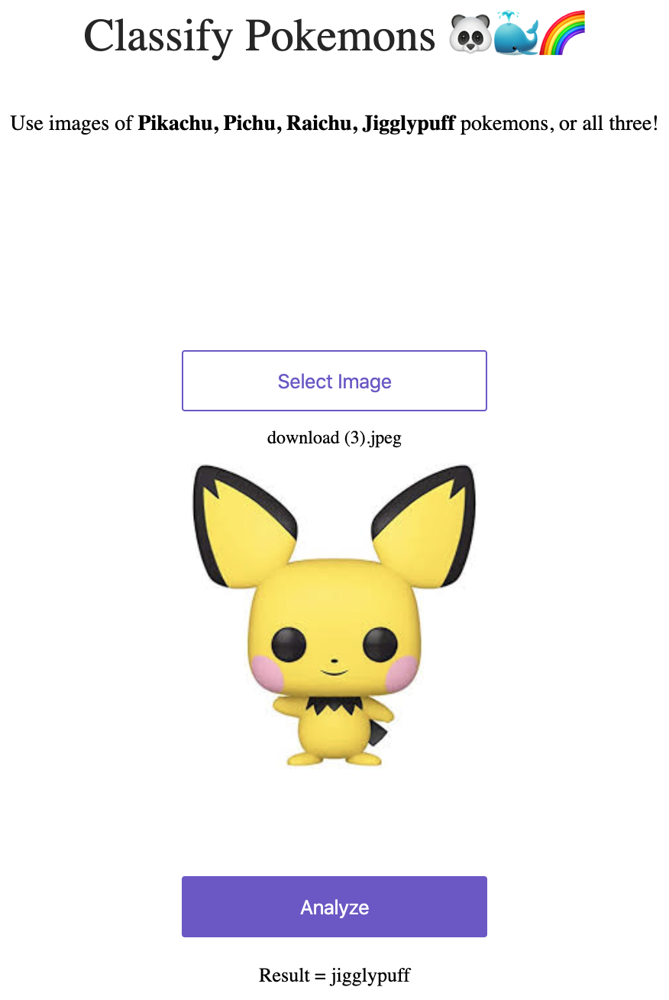

# GCP-app-deployment
 deploying fastai app on GCP
 
 1. Use the link : https://course.fast.ai/deployment_google_app_engine.html#grab-google-app-engine-starter-pack-for-model-deployment & deploy the app on GCP
 2. It segregates Pikachu, Pichu, Jigglypuff & Raichu images

### Results:

 | 
 | 
